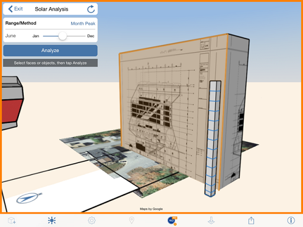

# Solar Analysis

Visualize the amount of solar radiation that your model receives.

Autodesk FormIt Pro Only

1. Tap on the Sun and Shadows icon then tap Solar Analysis.

   

2. Select an object or face.

   

3. Click Analyze.
4. View the Solar Analysis graph.

   

5. Tap the symbol to toggle between Month Peak or Year Cumulative.

   Change between Month Peak, which gives the peak solar insolation value in BTU/sq ft \(or Wh/sq m\) for each month, and Year Cumulative, which gives the total insolation in kw/Sq m. Month Peak is useful for developing a shading strategy for the building façade. Year Cumulative is useful for determining the potential for photovoltaic cells.

6. Move the slider to vary the time of year.

   

7. Tap Exit to finish.

