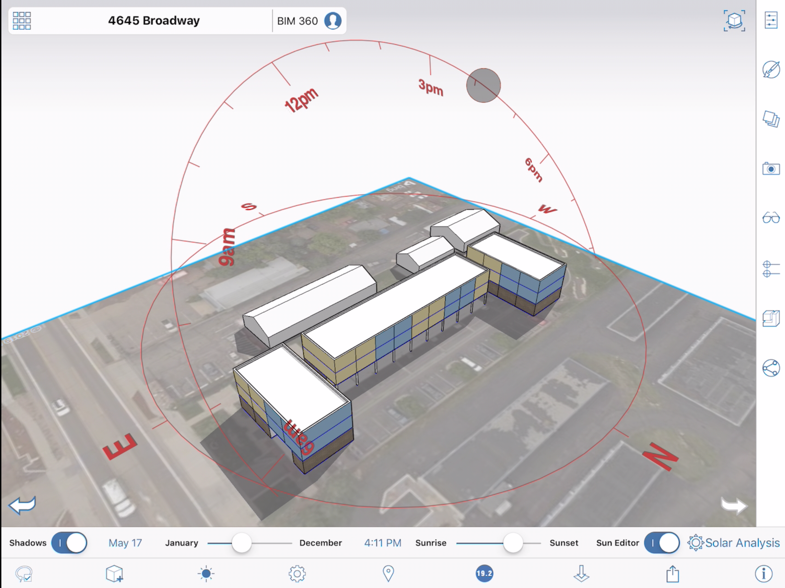

# Sun and Shadow Settings

Control the angle of the shadows at your locations by setting date and time.

* You can control the sun path and shadows by setting the date and time for each sketch.

  

Sun and shadows settings can be edited by tapping on the sun icon in the bottom toolbar. First, toggle on shadows. Then, use the slider or pick a specific date and time to set the position of the sun.

You can also edit the sun position through an on screen control. Turn on the **Sun Editor** switch in the tool bar. The sun path for the current date is shown and the location of the sun along the path can be changed by dragging the control.

