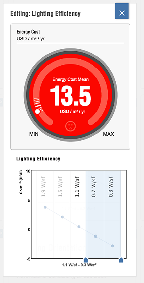

# Whole Building Energy Analysis

Evaluate factors that affect building performance, such a wall insulation and HVAC efficiency.

Autodesk FormIt Pro Only

The FormIt Pro Energy Analysis feature allows you to better understand how your design will perform based on a number of factors. To get started, you must first set a Location for your project and have at least one solid object with Levels applied. Tap the Energy Analysis button to open the Energy Analysis Dashboard.

Before you analyze your own model, you can open the Building Form widget to review 13 previously modeled forms. To see how these forms will perform in the current project location, tap the form and then tap the X to close this window.

The Energy Analysis Dashboard is now filled with a number of Factor Widgets.

When you open a Factor Widget, you can vary the factors to see how it affects the Energy Cost Mean.

