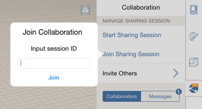

# Joining a Session

Become part of a collaboration.

* Login to your [**Autodesk**](https://360.autodesk.com) account.
* Tap the link provided to you by the session host, or paste the link URL into your Web browser address bar.

  

* Copy and paste the session ID into the Join Collaboration box.

  

  You will be added as a collaborator and your icon will appear on the toolbar. Tap the red camera icon next to a collaborator's name to follow that person's session camera.

* When you are done collaborating, just Tap Leave Sharing Session.

Please note if you leave a session as a guest collaborator, a copy of the sketch will NOT be saved to your Autodesk account.

