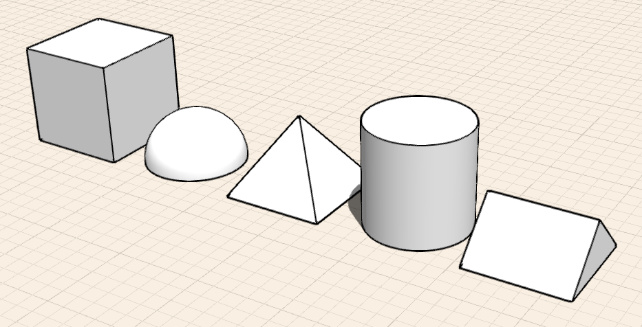

# Creating Designs

Sketch or place geometric shapes onto grid backgrounds, satellite images, or overlays.

* Create conceptual models using 2D and 3D geometry creation tools. Start off by sketching 2D shapes or placing 3D primitives. Then, you can modify your designs by pushing and pulling faces, and by using various transform tools and Boolean operations.

There are two main ways to create geometry: Sketching shapes, and placing primitives. You can also import geometry.

There are 5 types of tools that you can sketch with: Lines, Arcs, Splines, Rectangles, and Circles.

## Sketching Shapes

* Creation tools are located in the action bar. You create shapes by clicking on a tool from the Sketch tool set. Then, click in the view to define the shape.

There are 5 types of 3D primitives that you can place: Cubes, Domes, Cylinders, Prisms, and Pyramids.

## Placing Primitives

* You can place primitives by selecting a tool from the Geometry Creation toolbar. Then, tap and drag in the canvas to place the geometry.

To create more complex designs after sketching a shape or placing a primitive, you can use several contextual tools to modify your geometry. These operations include: Select, Delete, Move, Scale, Rotate, Extrude, Cut Face, Offset Face, Tilt, Copy/Paste, Array, and Boolean \(Union and Subtract\). Use the topics in the following list to learn more about these operations.

## See Also

* [Modify: Delete/Edit/Move ](https://github.com/formit3d/autodesk-formit-360-ios-help/tree/d5b2b6decb71d74e64b7991eaa6f7358c2312bf7/Modify%20Designs/Modify%20Delete,%20Edit,%20Move.md)
* [Modify: Extrude/Cut/Offset Face ](https://github.com/formit3d/autodesk-formit-360-ios-help/tree/d5b2b6decb71d74e64b7991eaa6f7358c2312bf7/Modify%20Designs/Modify%20Extrude,%20Cut-Offset%20Faces.md)
* [Modify: Select Edge/Face ](https://github.com/formit3d/autodesk-formit-360-ios-help/tree/d5b2b6decb71d74e64b7991eaa6f7358c2312bf7/Modify%20Designs/Modify%20Select%20Edge-Face%20or%20Object.md)
* [Modify: Scale/Rotate ](https://github.com/formit3d/autodesk-formit-360-ios-help/tree/d5b2b6decb71d74e64b7991eaa6f7358c2312bf7/Modify%20Designs/Modify%20Scale%20and%20Rotate.md)
* [Modify: Tilt/Array/Copy/Paste ](https://github.com/formit3d/autodesk-formit-360-ios-help/tree/d5b2b6decb71d74e64b7991eaa6f7358c2312bf7/Modify%20Designs/Modify%20Tilt,%20Array,%20Copy-Paste.md)
* [Modify: Boolean Operations ](https://github.com/formit3d/autodesk-formit-360-ios-help/tree/d5b2b6decb71d74e64b7991eaa6f7358c2312bf7/Modify%20Designs/Modify%20Boolean%20Operations.md)

## Topics in this section

* [Import 3D Models and Images ](https://github.com/formit3d/autodesk-formit-360-ios-help/tree/d5b2b6decb71d74e64b7991eaa6f7358c2312bf7/Import%203D%20Models%20and%20Images.md)

  Add overlays and images to your designs for a variety of purposes.

* [Sketching Shapes](https://github.com/formit3d/autodesk-formit-360-ios-help/tree/d5b2b6decb71d74e64b7991eaa6f7358c2312bf7/Sketching%20Shapes.md)

  Use Lines, Arcs, Splines, Rectangles, and Circles to create shapes that you can combine into building designs.

* [Place Primitives](https://github.com/formit3d/autodesk-formit-360-ios-help/tree/d5b2b6decb71d74e64b7991eaa6f7358c2312bf7/Place%20Primitives.md)

  Use pre-defined shapes as design building blocks.

