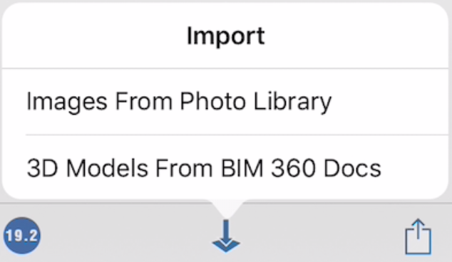

# Import 3D Models and Images

## Importing Images

Add overlays and images to your designs for a variety of purposes.

Ground overlays add additional information to your sketch or provide a schematic to trace over.

 

1. Select an image from your Photo Library.

You will have the option to scale and crop your image. Your image will then be imported into the canvas.

1. Use the palette on the right-side of the screen to modify image properties.

Edit the image's name and transparency, if needed. Manage the vertical ordering of various ground overlays including the satellite image.

## Importing 3D Models

After selecting **3D Models From BIM 360 Docs** from the menu, you will be able to choose a file from your BIM 360 projects. You may import **axm**, **obj**, **stl** and **sat** files. The imported objects will be collected in a group and placed at the world origin.

