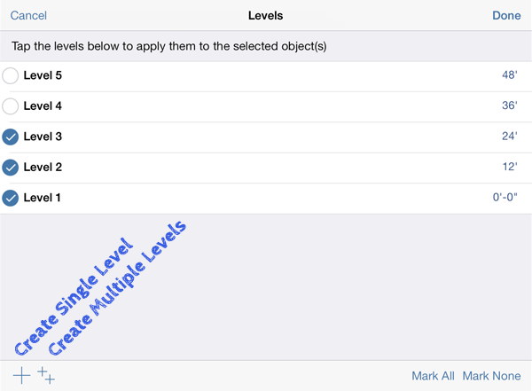

# Levels and Space Usage

See area calculations for objects in a design.

## Enable Levels

1. Tap on the Settings icon on the bottom toolbar.
2. Select Levels to specify the height of each level.

   

3. Specify the levels that are applied to each object in the sketch .

   Use the + \(plus\) or double ++ symbols to add values.

   

## Properties and Space Usage

Open the right-side palette to the Properties tab to view or edit the properties of selected individual objects in a sketch. Under Properties, you can edit the object's name, see its volume/area, or toggle/edit levels.

* As you add geometry, the Gross Area and Floor Area Ratio will automatically update for the entire sketch. To activate this feature and add individual elements to these figures, the Area by Level toggle must be enabled on each object.

  

