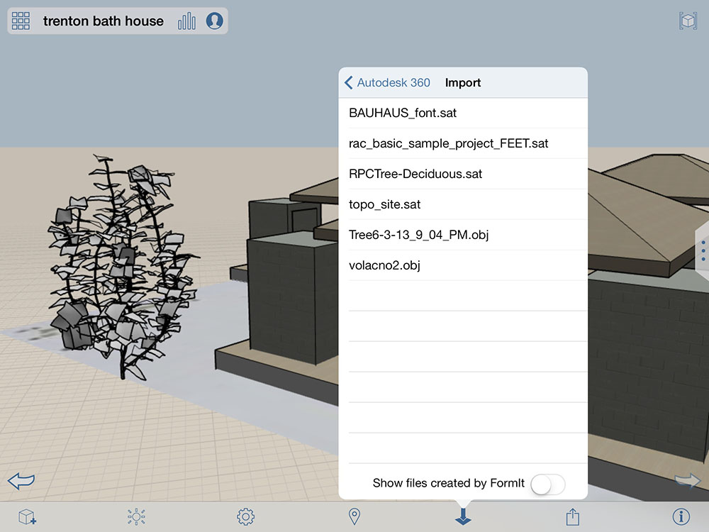

# Location

Define a geographic location to make use of building performance and climate data with your designs.

To maximize the functionality of your designs, you should define the geographic location of your sketch using the Location feature. Setting the location is important when you want to use Building Performance data while designing. See Building Performance for more details.

* You can import geometry from your BIM 360 Docs projects using OBJ, SAT, STL or AXM formats. Just click on the import icon from the toolbar and choose **Import 3D Models From BIM 360 Docs**.

    .

## Topics in this section

* [Set a Location](https://github.com/formit3d/autodesk-formit-360-ios-help/tree/d5b2b6decb71d74e64b7991eaa6f7358c2312bf7/Set%20a%20Location.md)

  Establish a geographic location for your sketch.

* [Satellite Image Import](https://github.com/formit3d/autodesk-formit-360-ios-help/tree/d5b2b6decb71d74e64b7991eaa6f7358c2312bf7/Satellite%20Image%20Import.md)

  Add detail and realism to your design.

* [Edit, Reload, or Remove a Satellite Image](https://github.com/formit3d/autodesk-formit-360-ios-help/tree/d5b2b6decb71d74e64b7991eaa6f7358c2312bf7/Edit,%20Reload,%20or%20Remove%20a%20Satellite%20Image.md)

  Make changes to your location images.

