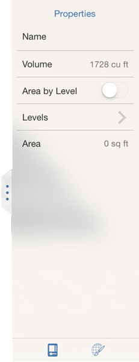

# Examine Object Properties

View or change a building object's name or its volume/area and level values.

## Modify Properties and Enable Space Updates

1. To edit the properties of individual objects in a sketch, just double tap to select the entire object and open the right-side palette to the Building Properties tab.
2. Edit the object's name, see its volume/area, toggle to see Area by Levels, and add or edit level values.
3. To automatically update the Gross Area and Floor Area Ratio for the entire sketch, turn on the Area by Level toggle for each object.

   

