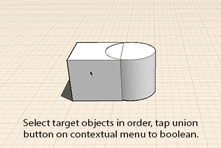

# Modify: Boolean Operations

Use Join and Cut operations to alter objects.

1. Union: To perform a union, select all the objects you want to boolean. Then, select the union tool from the context menu. The intersecting/overlapping portion of the geometry will be united into one object.
2. Subtract: To subtract volumes from existing geometry, first select the original object.
3. Next, select the object you want to subtract from it.
4. Then, select the subtract tool from the context menu.

The intersection volume will be subtracted from the original object.

