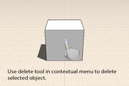
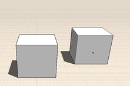

# Modify: Delete, Edit, Move

Remove an object, change its location, or modify its properties.

1. To delete geometry, you must first make a geometry selection. Then, long press to see the context menu where you can tap the delete icon.
2. To move edges, faces, or objects, first select, then you are automatically in the move tool. The placement point which snaps to other geometry in the model can be changed by dragging it to a new location, such as the corner of the box in the example. Next start dragging the object by placing the finger anywhere on it. Move the object so that the placement point snaps to the desired final location.

