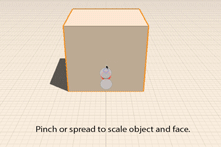
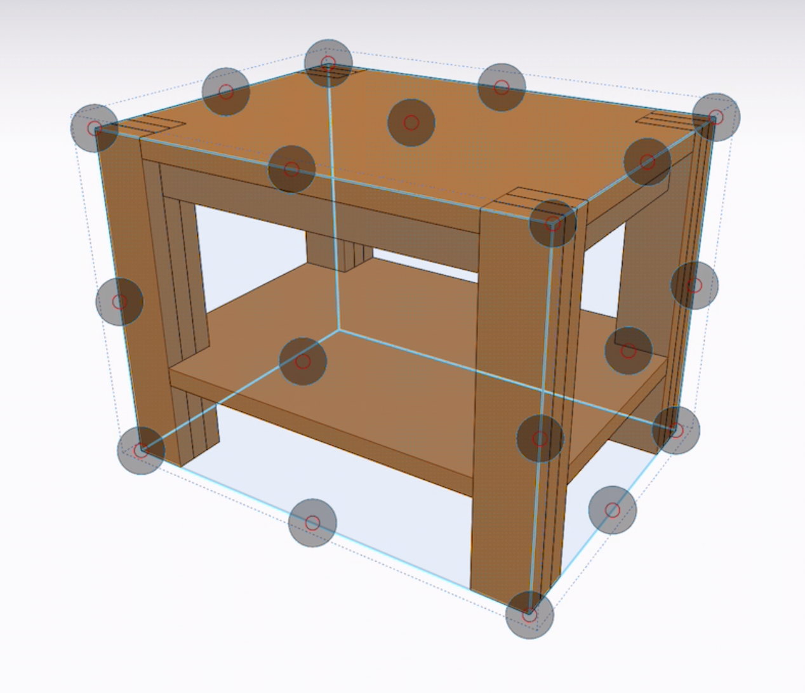
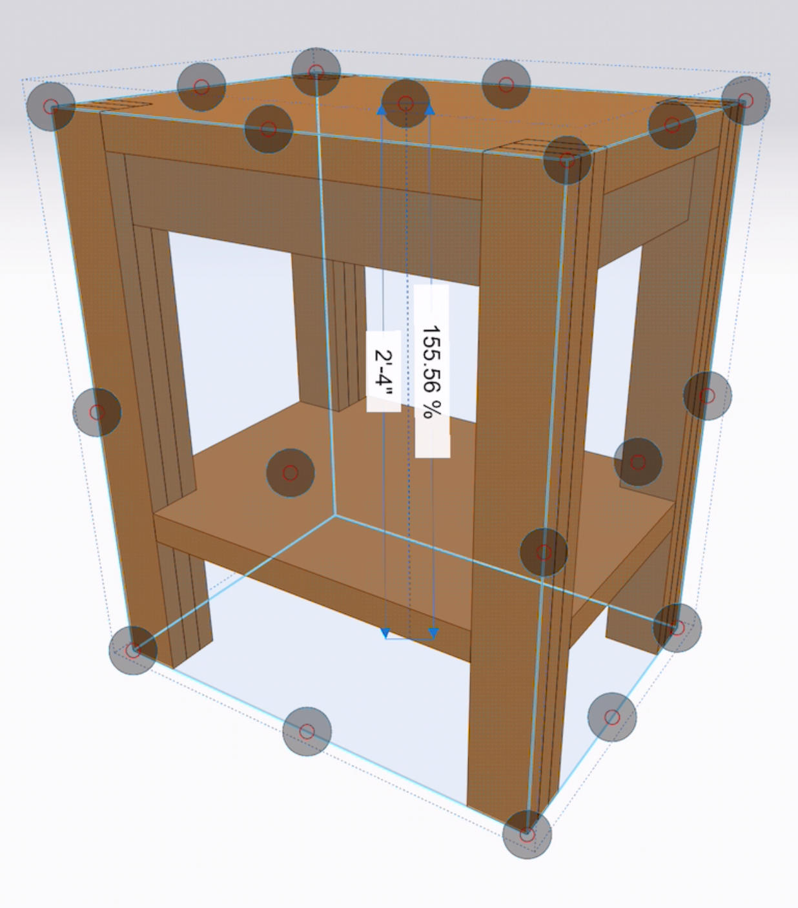
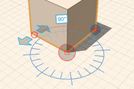

# Modify: Scale and Rotate

Adjust the size and orientation of objects.

1. To scale edges, faces or objects, first select, tap and hold to access the context menu, then choose the scale icon. Use the on screen controls to place the scale center and scale base magnitude. Drag the arrow to scale the selected entities.
2. To non uniformly scale the selected entities choose the Non Uniform Scale icon from the context menu. This will show a bounding box with controls at the corners, edge midpoints and side midpoints. Dragging any of these controls will scale the entities about the opposite point. In the example below the object was scaled in the z direction by dragging the top midpoint upwards.    
3. To rotate edges, faces, and objects, select and long-press to access the rotate tool from the context menu. Use the on screen controls to change the rotation center and axis. Drag the arrows to specify the start and end of the rotation angle.

