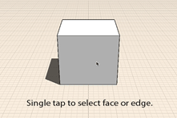
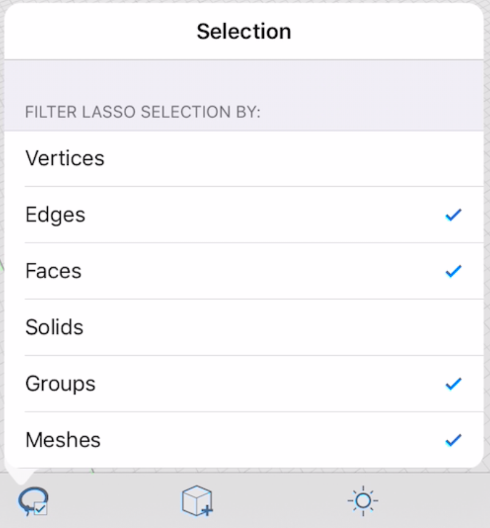

# Modify: Select Edge/Face or Object

Choosing an object or surface is the first step to making modifications.

1. To select a face, edge or vertex, hover over them - then single tap to select.
2. To select an entire object, double tap the object.
3. For more precise control in selecting multiple pieces of geometry simultaneously, use the lasso tool. You can select it from the context menu after tapping over the empty canvas. Then draw a line around your desired selection area. Which types of entities are picked by the lasso tool depends on the items selected in the Selection menu, which you open by tapping the   icon on the left of the bottom tool bar

  

