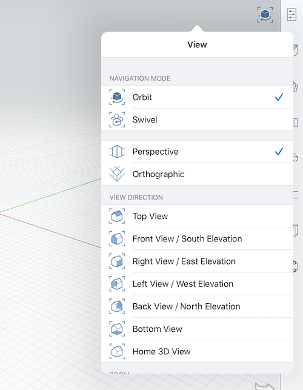
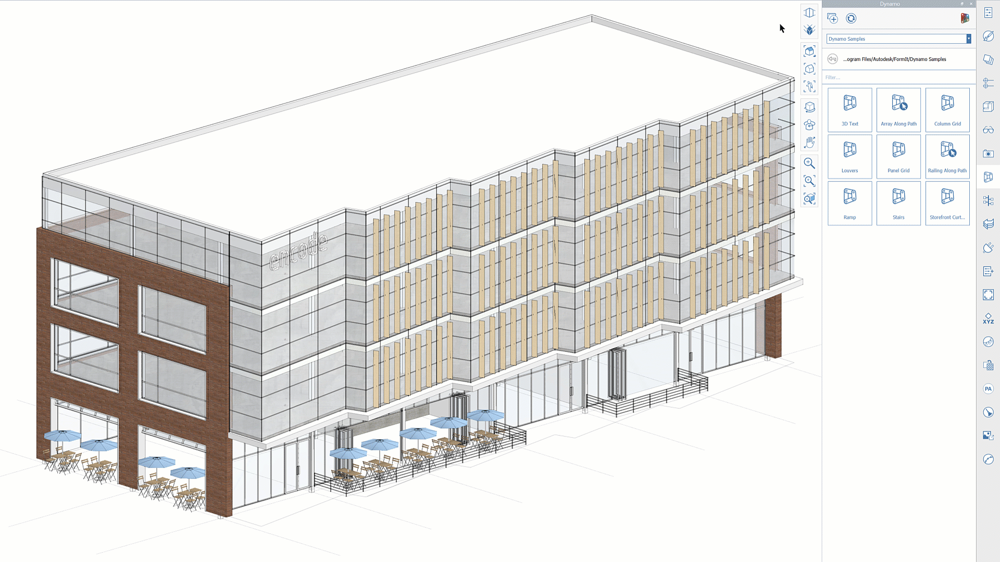

# Orthographic Camera

FormIt 2021 includes the addition of a new Orthographic Camera feature. You can find the Orthographic and Perspective buttons in the Navigation Menu:

This new option allows you to easily toggle between the Orthographic and Perspective camera views. 

Once in Orthographic camera, any other camera tools will respect the current mode. For example, **Align Camera to Face** will align the Orthographic Camera to the face, resulting in an orthographic elevation view.

**Note:** If camera clipping occurs in Orthographic Camera mode, you can switch back to Perspective Mode, zoom out, and then try again. 

