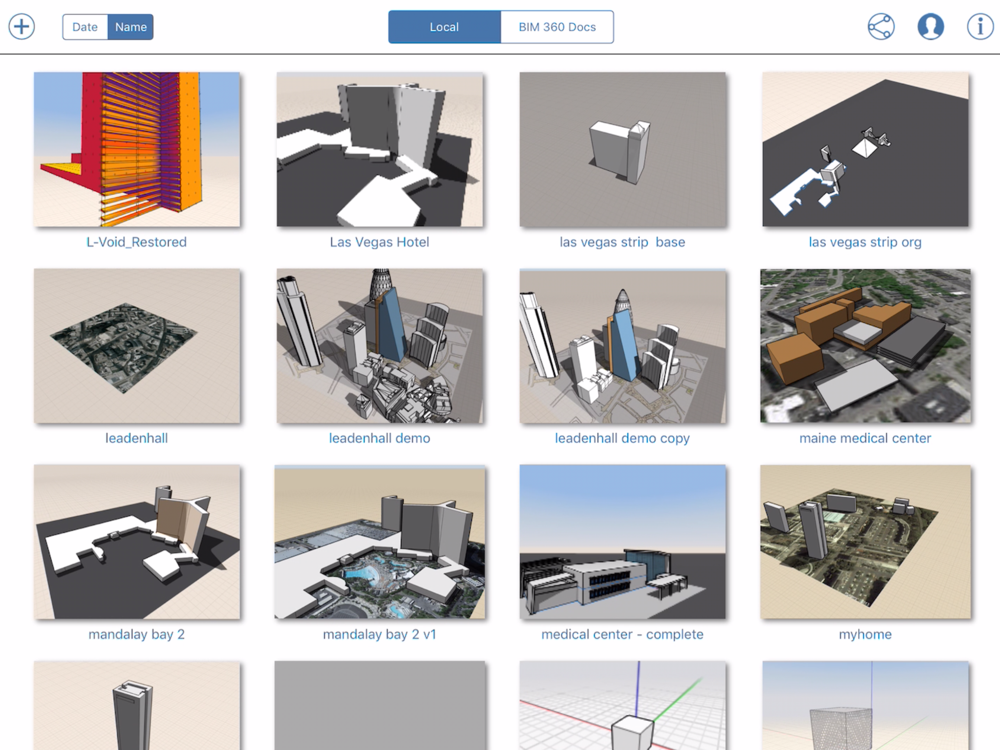
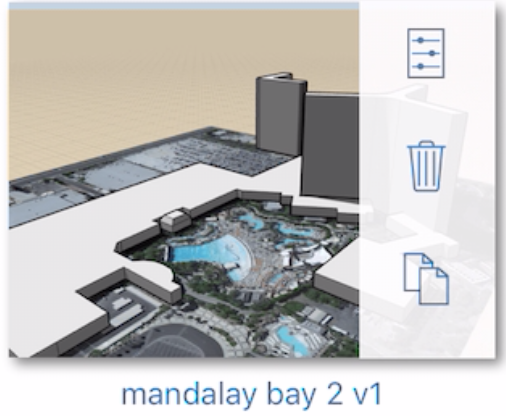
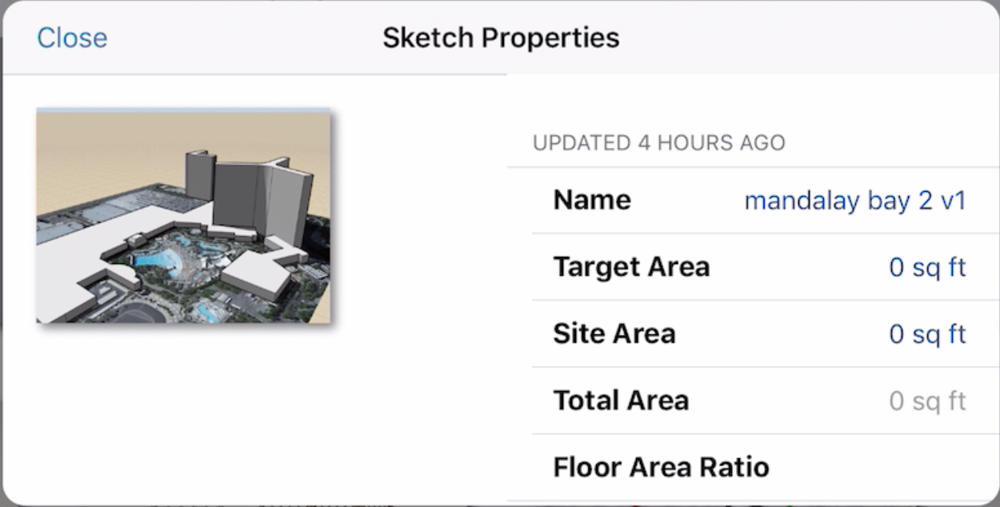
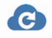

# Opening Files

When starting up, FormIt will display a gallery with files that are saved on the device. If you are subscribed to BIM 360 Docs, the gallery will also show files that are in all the BIM 360 accounts that you are a part of. You can switch between the two displays by tapping on the **Local** or **BIM 360 Docs** selector at the top of the gallery.

## Local Files

The files show under the Local selector are stored with the FormIt application on your device. You can access them anytime, even when you are not online. 

If you swipe across a file icon, you get a menu which will allow you to delete the file, make a copy or open a dialog where you can view and edit some basic information about the sketch.

  

## BIM 360 Docs

In the BIM 360 Docs gallery display, you will see a listing of all BIM 360 Docs accounts that you are part of. For each account a list of projects are displayed and for each project you will see a list of files on the right side. Make sure that you are connected to the internet, are logged into your Autodesk account and have a valid BIM 360 Docs subscription. Note, that only file types that can be opened are shown. These are files with **axm**, **obj**, **stl** and **sat** extensions. Once the files in the BIM 360 Docs gallery are displayed you will need to refresh the display by selecting the  button, if your content in any BIM 360 Docs project has changed, for example, when someone uploads a new file directly on the BIM 360 Docs website. For more information on how to set up your BIM 360 Docs account and how to migrate your existing files from A360 Drive, please [**visit this page**](https://formit.autodesk.com/page/formit-bim-360-docs). 

To open a file from either source tap on the file's icon. This will launch the 3D environment in which the sketch is shown.

