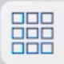
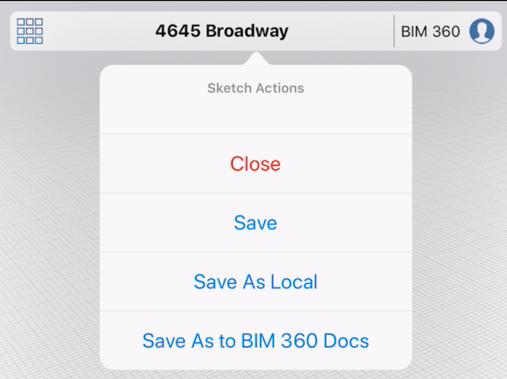

# Saving Files

Once you have made changes to a sketch, you can save it back to a file. In the top left corner of the 3D environment tap the  icon. This will bring up the Files menu. You may also save a copy of the sketch  by choosing the **Save As Local** or **Save As to BIM 360 Docs** option.

