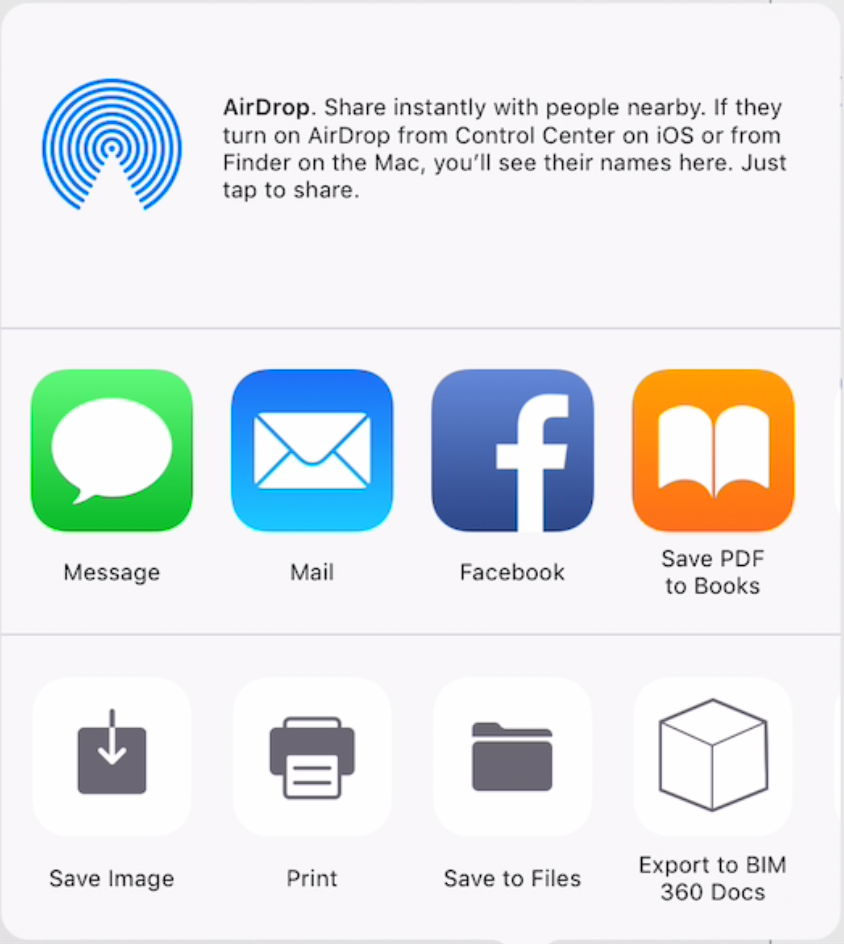
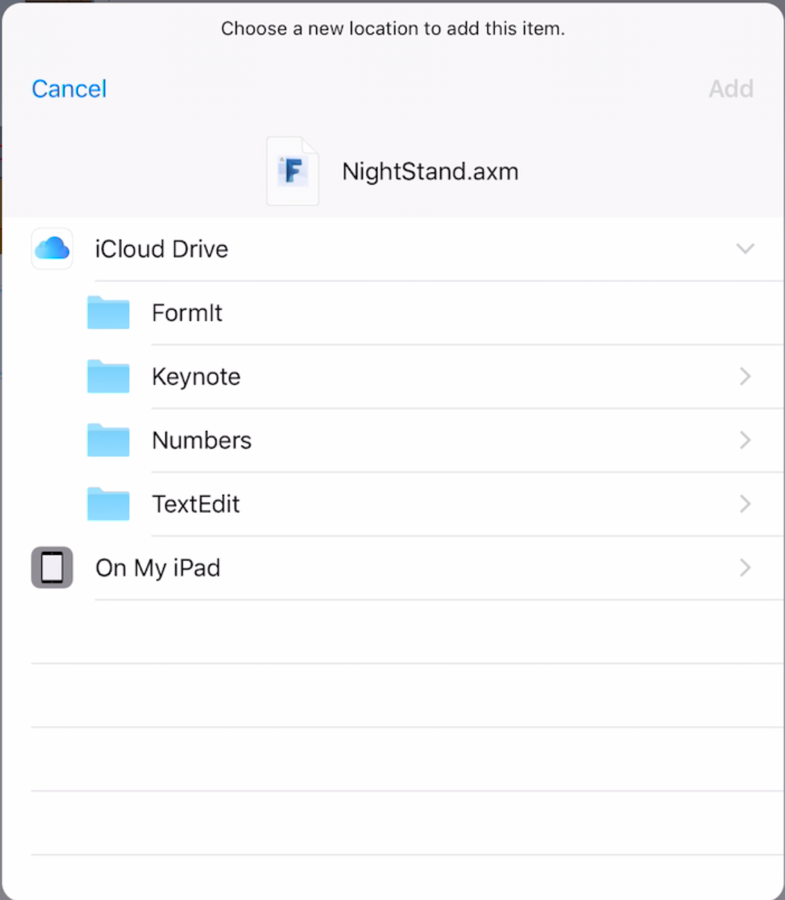

# Sharing Your Work

From the  icon in the bottom tool bar you can access the standard iOS share menu. 

 

From there you may:

* Create an e-mail or message with a screen shot already placed
* Save a screen shot of your sketch to the Photo Library
* Send the screen shot to a AirPrint enabled printer
* Export your 3D sketch as an **axm** file to the Files app on the iPad. If you place the file inside the **iCloud Drive** folder, you can access it from other devices that can connect to your iCloud account. 
* Export your 3D sketch to one of your BIM 360 Docs projects. You may choose between different 3D formats: **axm**, **obj**, **stl** or **sat**.
* Airdrop your 3D sketch to another iOS device nearby.

