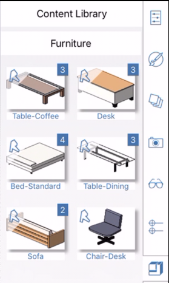
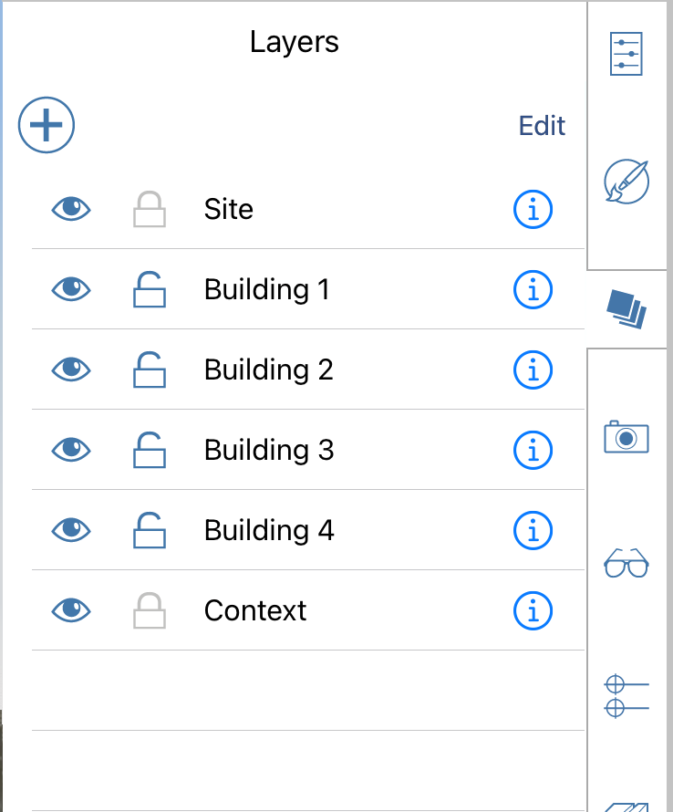

# Context Menu and Palette

Locate the tools to create and place designs.

The software's user interface makes use of a particular platform's standard interaction model.

## Contextual Menu

* To bring up the contextual menu, Long-press over an object or empty space. Depending on the selection, different tools will appear on the contextual menu that will let you edit the selection.

### Palettes

* Tap on an icon on the right side of the screen to open a palette. Palettes contain useful tools and information about your design. For example, you can use the Properties Tab to manage an object's name, define level settings, and receive feedback about area and volume.

  

* You can use the Materials Tab to create, edit, and apply materials to objects.

  

* Use the Content Library to access pre-made models from your local computer. Then you can drag and drop content from the library into your FormIt sketch.  

  

* Place objects and groups on Layers by accessing the Layers tab. Control visibility and locking for more control.   

