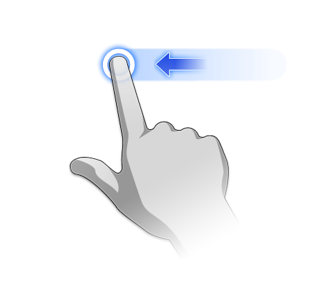
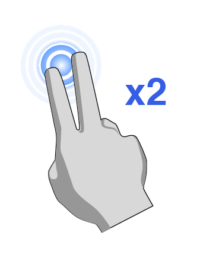
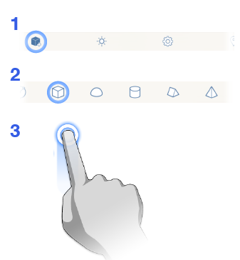
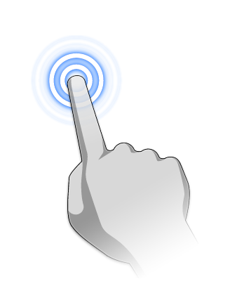
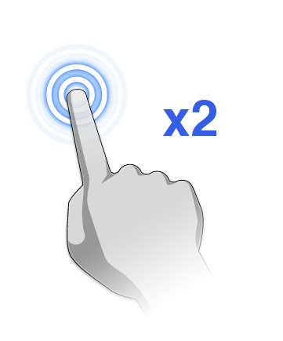

# Gestures

Use these movements to engage the user interface.

## Gesture and Interaction Guide

### Navigating the View

|  |  |  |
| :--- | :--- | :--- |
| Pan | Two-finger drag |  |
| Orbit | Single-finger drag |  |
| Zoom in and out | Pinch and spread |  |
| Zoom to fit the whole model | Two-finger double tap |  |
| Zoom to fit the current selection | Two-finger single tap |  |
| Clear the current selection | Three-finger single tap or tap once with a single finger anywhere in empty space |  |

### Create Geometry Gestures

|  |  |  |
| :--- | :--- | :--- |
| Draw 2D Shapes | Tap on the line, arc, spline, or rectangle tool, then tap-drag-lift to draw |  |
| Extrude Shapes | Tap to select a face, and then drag your finger up or down. |  |
| Place a Primitive | From the action bar, tap the Primitive icon. When the menu displays, tap the primitive you would like to place in your sketch. Tap the canvas and drag to where you would like to place the primitive. |  |

### Select Geometry Gestures

|  |  |  |
| :--- | :--- | :--- |
| Select a Face | Single tap on the face you want to select. |  |
| Select a Body | Double tap anywhere on the body. |  |
| Edit a Group | Double tap on any geometry in the group. |  |
| Exit a Group | Single tap anywhere outside of the group bounding box. |  |

