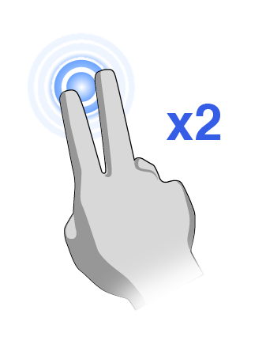
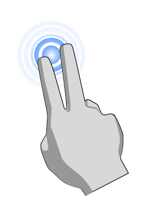
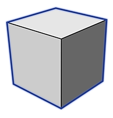

# Gestures

Use these movements to engage the user interface.

## Gesture and Interaction Guide

### Navigating the View

|  |  |  |
| :--- | :--- | :--- |
| Pan | Two-finger drag |  |
| Orbit | Single-finger drag |  |
| Zoom in and out | Pinch and spread |  |
| Zoom to fit the whole model | Two-finger double tap |  |
| Zoom to fit the current selection | Two-finger single tap |  |
| Clear the current selection | Three-finger single tap or tap once with a single finger anywhere in empty space |  |

### Create Geometry Gestures

|  |  |  |
| :--- | :--- | :--- |
| Draw 2D Shapes | Tap on the line, arc, spline, or rectangle tool, then tap-drag-lift to draw |  |
| Extrude Shapes | Tap to select a face, and then drag your finger up or down. |  |
| Place a Primitive | Tap on primitive from action bar, then tap-drag-lift to place an object. |  |

