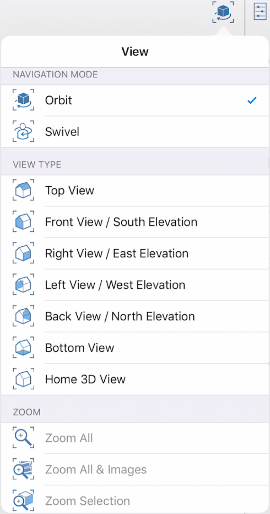
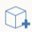

# User Interface tools

Reference for command interaction tools.

* Save the Sketch: Tap to bring up a menu which allows you to save the current sketch to the local file storage or to BIM 360 Docs, save a copy or return to the gallery.

  

* Login to Autodesk 360: Use the Autodesk 360 Cloud Services for FREE to store and share your sketches.

  

* With the View Settings menu, you can choose from a selection of preset views. These views will allow you to quickly visualize your model from different perspectives, plan and elevation views and zoom levels. The **Orbit - Swivel** option determines the behavior of the one finger drag action. When **Orbit** is selected, the camera will move around a fixed point in the scene, continuously looking at that point. This works well to navigate around objects from the outside. **Swivel** keeps the camera at a fixed location and rotates the direction at which the camera is pointed. Think of sitting on a rotating office chair and spinning around. This works well when you are located inside a building and want to look around the interior without moving the camera.

   

## The Action Bar

* The action bar is found on the bottom of your screen. The tools in the action bar will help you create, edit, and share content.

*  Create Geometry: Tap to bring up a menu of creation tools that will help you draw shapes and primitives.
* Change the Lighting and Shadows: Use this tool to change the date and time of day, and to launch a Solar Analysis \(Pro only\).
*  Set the Location: Search for a location and import satellite imagery into your sketch. For more information on setting the location of your sketch, see [Location](../location/) .
* Energy Analysis: Perform an analysis of a design's energy usage.
*  Import Images and Models: Have content you want to import? Use this tool to add images and models you created with other programs.
* Share your work: Want to share your work with others? Email your sketch or even share with other nearby devices the AXM file of your work via AirDrop.
* Need more help?: Use the information tools to learn more about FormIt.

