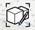

# Edit Group

Update or make changes to an existing group.

1. Tap on the group you wish to edit.
2. Display the Context Menu and tap the Edit Group icon  or use a double tap as a shortcut into edit mode.
3. Modify geometry to make edits to group objects.

   You can use the Undo/Redo arrows within edit mode to erase or duplicate your most recent change. Once you exit edit mode, these tools make changes to the full drawing as before. They will no longer affect the group.

4. When you complete your edits, tap Done in the upper left corner.

   

