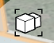

# Nest Groups

Cluster like elements within a design.

You can treat groups as container elements, within which other smaller groups live. These nested groups can be used to create larger group structures

1. Select an existing group.
2. Add one or more new objects to the group.
3. Select objects or faces that you want to add to a second group.
4. Display the Context Menu and tap the Group icon.
5. Tap Done in the upper left corner.

