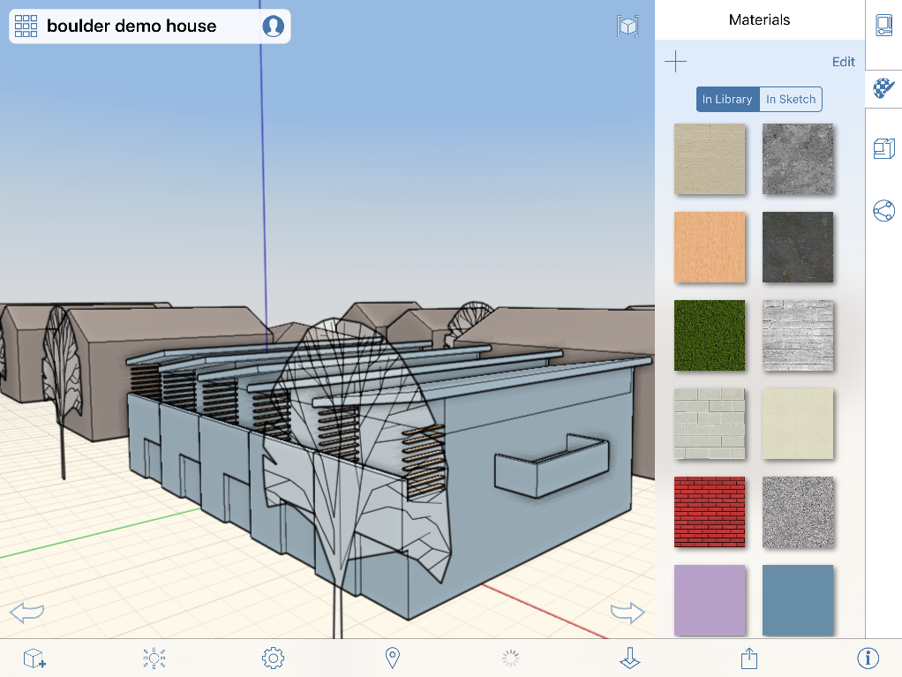

# Using Materials

Enrich and enhance designs using Materials to add detail.

The Material Editor is located in the right-side palette. In the Editor, you can create new materials and add them to your Material Library. To add color to a material, you can use the color picker to accurately set the tint for the material or select a predefined color swatch.

The widgets provided by the Materials Editor allow you to:

## Apply a Material

1. To apply a material, first select a face or object.
2. Tap the tab on the right side of the screen and tap the icon for the Material Editor.
3. Choose a material from the displayed selection, or create your own.

   

When applied to the sketch, materials will be added to a list of already used materials for easy access. A material can have a texture \(bitmap\) and/or color. When a material has both texture and color, the two are blended together.

### Topics in this section

* [Create a Material](https://github.com/formit3d/autodesk-formit-360-ios-help/tree/d5b2b6decb71d74e64b7991eaa6f7358c2312bf7/Create%20a%20Material.md)

  Use the Material Editor to create new materials to use in your scene.

* [Edit a Material](https://github.com/formit3d/autodesk-formit-360-ios-help/tree/d5b2b6decb71d74e64b7991eaa6f7358c2312bf7/Edit%20a%20Material.md)

  Use the Material Editor to make materials appear exactly as you want.

