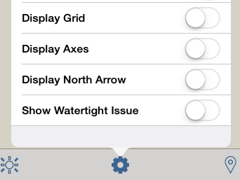

# Visual Format Options

Description of choices for visual style.

## Visual Style Options

|  |  |
| :--- | :--- |
|  |   __Snap to Grid_: Toggle to turn grid snaps on and off._  _Edge Contrast:_ Raise or lower the contrast of how edges are displayed.  __Silhouette Contrast:_Raise or lower the contrast of how silhouette edges are displayed._  _Units_: Specify the sketch's units, Imperial or Metric  __Visual Styles: _Change the appearance of your sketch by toggling features like sketchy lines, hidden lines, or extended lines._      __ _Display sketchy lines_: Change the appearance of your sketch by toggling making lines to appear that they have been sketched by hand      __Show hidden lines_: Display faint lines that are normally hidden by other faces_     __ _\*Extend lines_: _Display short extensions where lines intersect_     __ _Thick edges_: Widest lines possible      __Hide edges_: Toggle this feature to turn off edges in your model._  _Levels_: Edit Level heights for the entire sketch \(see Apply Levels for more details\)  __Display Levels: \*Toggle the visibility of levels  |
|  |   __Display Grid: _Toggle the visibility of the grid_  _Display axes:_ Toggle the visibility of the coordinate system axes  __Display north arrow: _Toggle the visibility of the north arrow_  _Show Watertight Issue:_ Used for 3D printing to ensure model integrity  |

